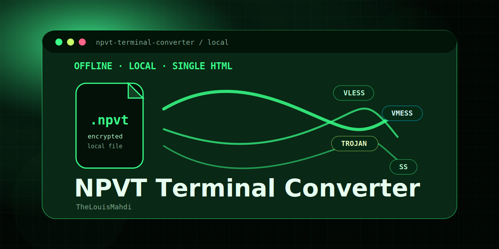

<div align="center">



# NPVT Terminal Converter

<p>
  
  
  
</p>

<p>
  <a href="#overview">Overview</a> ·
  <a href="#features">Features</a> ·
  <a href="#quick-start">Quick Start</a> ·
  <a href="#supported-inputs">Supported Inputs</a> ·
  <a href="#privacy">Privacy</a>
</p>

</div>

---

## Overview

**NPVT Terminal Converter** is a single-file HTML tool for converting supported NPVT, JSON, raw text, and Base64 subscription data into V2Ray-style links. It also includes a reverse converter that builds a portable NPVT-style bundle from pasted links.

Open `index.html` locally, convert, copy, and download. No backend setup is required.

---

## Features

<table>
<tr>
<td width="50%">

### Two-way conversion

- NPVT / JSON / subscription to V2Ray links
- V2Ray links to NPVT-style bundle
- Multiple links supported

</td>
<td width="50%">

### Local workflow

- Drag-and-drop file import
- Fallback file picker
- Copy and download output

</td>
</tr>
<tr>
<td width="50%">

### Interface

- Responsive desktop/mobile layout
- Floating side navigation
- Clean result table

</td>
<td width="50%">

### Shortcuts

- Press `Enter` to convert
- Use `Shift + Enter` for a new line
- Clear table, logs, and panels quickly

</td>
</tr>
</table>

---

## Quick Start

```bash
git clone https://github.com/TheLouisMahdi/npvt-terminal-converter.git
cd npvt-terminal-converter
```

Then open:

```text
index.html
```

---

## Supported Inputs

### NPVT / File to V2Ray Links

The first converter can read supported local files and scan for links from:

- `.npvt` files compatible with the supported NPVT-style structure
- JSON exports
- Raw text files containing V2Ray-style links
- Base64 subscription text
- Mixed files containing multiple configs

### V2Ray Links to NPVT-style Bundle

The second converter accepts links such as:

```text
vless://...
vmess://...
trojan://...
ss://...
```

Then it generates a downloadable local bundle.

---

## Privacy

Everything runs locally inside your browser. The project does not need a backend server for the conversion workflow.

For public bug reports or screenshots, replace real connection details with dummy values.

---

## Repository Structure

```text
npvt-terminal-converter/
├── assets/
│   └── brand-preview.svg
├── docs/
│   └── BRAND_GUIDE.md
├── index.html
├── README.md
├── LICENSE
├── CHANGELOG.md
├── SECURITY.md
├── CONTRIBUTING.md
└── .github/
    └── ISSUE_TEMPLATE/
```

---

## Browser Support

Recommended browsers:

- Google Chrome
- Microsoft Edge
- Firefox
- Brave

The app uses modern browser APIs such as FileReader, Blob, TextEncoder, TextDecoder, and clipboard access.

---

## Author

<div align="center">

Made by **Mahdi Gh**  
GitHub: [TheLouisMahdi](https://github.com/TheLouisMahdi)

</div>

---

## License

This project is released under the MIT License.
