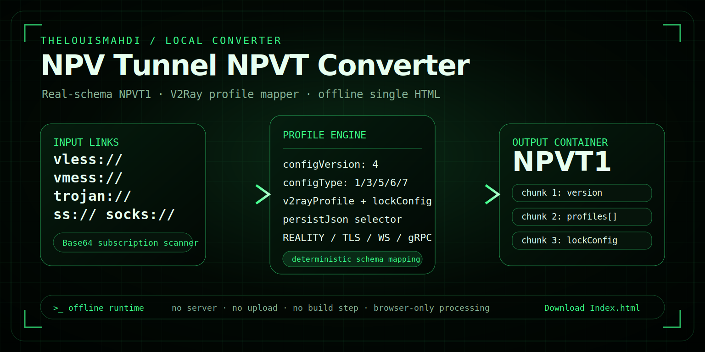

<div align="center">



# NOVA Private Vault Converter

<p>
  <strong>Offline · Local · Single HTML</strong>
</p>

<h2>
  <a href="https://github.com/TheLouisMahdi/npvt-terminal-converter/raw/main/Index.html">⬇ Download Index.html</a>
</h2>

<p>
  <a href="https://github.com/TheLouisMahdi/npvt-terminal-converter/raw/main/Index.html">
    
  </a>
  
  
</p>

</div>

---

## Download

Download the app as one portable HTML file:

```text
https://github.com/TheLouisMahdi/npvt-terminal-converter/raw/main/Index.html
```

Then open `Index.html` in your browser.

---

## Overview

**NOVA Private Vault Converter** is an offline browser-based converter built as a single HTML file. It is designed for local use, with no installation, no backend server, and no upload workflow.

The project focuses on a clean green terminal-style interface, simple file handling, and a direct download experience for public users.

---

## Features

| Feature | Description |
|---|---|
| Single-file app | The whole tool is inside `Index.html`. |
| Local workflow | Conversion runs in the browser. |
| Offline use | Download once and open locally. |
| Drag and drop | Import supported files directly. |
| Copy / export | Copy or download converted output. |
| Terminal UI | Green cyber-terminal visual style. |

---

## How to Use

1. Click **Download Index.html**.
2. Open the downloaded file in your browser.
3. Import a file or paste your content.
4. Convert locally.
5. Copy or export the output.

No setup is required.

---

## Privacy

NOVA is designed as a local browser tool. The conversion workflow does not require a server.

For public screenshots, issues, or examples, avoid sharing real private configuration data.

---

## Repository Layout

```text
Index.html   # Main application
README.md    # Project page
LICENSE      # License
assets/      # README preview image
```

---

## Public Release Settings

Recommended GitHub repository settings:

```text
Description: Offline local single-file private vault converter built as an HTML app.
Topics: nova, npvt, converter, offline-tool, html, javascript, single-html, terminal-ui
Social preview: use the current project preview image
```

---

## Author

Made by **Mahdi Gh**  
GitHub: [TheLouisMahdi](https://github.com/TheLouisMahdi)

---

## License

MIT License
