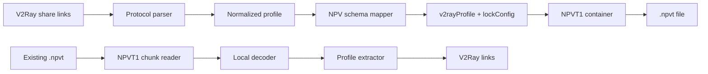
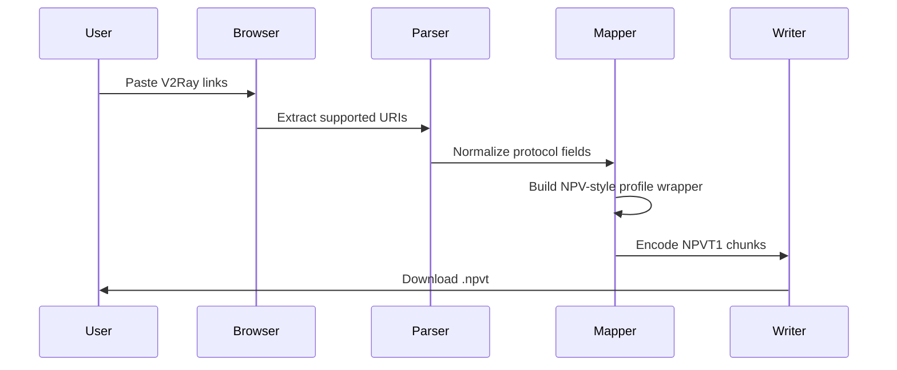
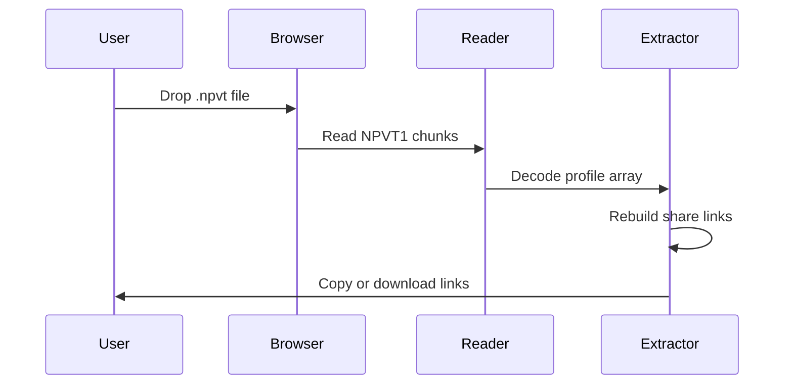

<div align="center">


# NPV Tunnel NPVT Converter

<strong>Offline · Local · Single HTML · Real-Schema NPVT1 Converter</strong>

<br><br>

<a href="https://github.com/TheLouisMahdi/npvt-terminal-converter/archive/refs/heads/main.zip">
  
</a>
<a href="https://github.com/TheLouisMahdi/npvt-terminal-converter/raw/main/Index.html">
  
</a>


<h2>
  <a href="https://github.com/TheLouisMahdi/npvt-terminal-converter/archive/refs/heads/main.zip">Download for mobile</a>
</h2>

<p>
  Mobile browsers may open raw HTML as text. Use the ZIP download above, then extract and open <code>Index.html</code> locally.
</p>

</div>

---

## Overview

**NPV Tunnel NPVT Converter** is a browser-only conversion engine for moving configurations between V2Ray-style share links and NPV Tunnel-compatible `.npvt` containers.

The project is designed as a single portable HTML file. It does not require installation, bundling, a backend server, external APIs, or upload endpoints. Conversion happens locally inside the browser runtime.

The current engine is based on the real NPVT1 structure observed from valid NPV Tunnel exports. Instead of placing raw links into a generic encrypted wrapper, it builds NPV-style profile objects with `v2rayProfile`, `lockConfig`, `configVersion`, `configType`, `persistJson`, and the expected top-level profile wrapper.

---

## Download

### Recommended for Android / iOS

Download the repository ZIP. This forces a real file download on mobile browsers:

```text
https://github.com/TheLouisMahdi/npvt-terminal-converter/archive/refs/heads/main.zip
```

After download:

1. Extract the ZIP file.
2. Open the extracted folder.
3. Tap `Index.html`.
4. Use the converter locally in your browser.

### Direct HTML Link

Desktop browsers usually handle the direct HTML file correctly:

```text
https://github.com/TheLouisMahdi/npvt-terminal-converter/raw/main/Index.html
```

On some mobile browsers, this link may display the source code as text instead of downloading it. Use the ZIP link above if that happens.

---

## Conversion Model



The converter supports two main workflows:

| Workflow | Input | Output |
|---|---|---|
| **V2Ray → NPVT** | `vless://`, `vmess://`, `trojan://`, `ss://`, `socks://`, mixed text, Base64 subscriptions | NPV-style `.npvt` file |
| **NPVT → V2Ray** | `.npvt`, `NPVT1`, JSON-like payloads, mixed text | Clean V2Ray share links |

---

## Supported Protocols

NPV Tunnel is listed as a V2Ray/SSH client with support for VLESS, VMess, Shadowsocks, Trojan, and SOCKS. This converter maps those protocol families into NPV-style profile objects.

| Protocol | Link parsing | NPVT export | Reverse extraction | Notes |
|---|---:|---:|---:|---|
| VLESS | Yes | Yes | Yes | TLS, REALITY, WS, gRPC, TCP, flow-aware |
| VMess | Yes | Yes | Yes | Standard Base64 `vmess://` payload parser |
| Trojan | Yes | Yes | Yes | Preserves password, TLS, SNI, WS/TCP fields |
| Shadowsocks | Yes | Yes | Partial | SIP002-style `ss://` parser |
| SOCKS | Yes | Yes | Partial | Basic SOCKS profile mapping |
| Base64 subscriptions | Yes | Extracts links | N/A | Decodes and scans supported links |

---

## NPVT1 Container Layout

The converter writes the observed three-part NPVT1 structure:

```text
NPVT1
<encrypted_version_chunk>,<encrypted_profile_array_chunk>,<encrypted_lock_config_chunk>
```

After local decoding, the logical structure is:

```text
chunk 1 -> "1"
chunk 2 -> JSON array of NPV-style profile wrappers
chunk 3 -> lockConfig JSON
```

A generated profile follows this structural model:

```json
{
  "name": "Profile name",
  "address": "server:port",
  "type": "V2RAY",
  "v2rayProfile": {
    "configVersion": 4,
    "configType": 5,
    "subscriptionId": "",
    "addedTime": 1780000000000,
    "remarks": "Profile name",
    "server": "example.com",
    "serverPort": "443",
    "password": "uuid-or-password",
    "network": "ws",
    "security": "tls",
    "v2rayJson": "",
    "persistJson": true
  },
  "lockConfig": {
    "version": 1,
    "isLocked": true,
    "password": "",
    "onlyMobileNetwork": false,
    "blockRootedAndJailbroken": true,
    "onlyOfficialStores": false,
    "expiryDate": "",
    "deviceIds": "",
    "message": "",
    "customServerMessage": ""
  }
}
```

---

## Computable Mapping Rules

The conversion engine uses deterministic mapping rules so each share link becomes a predictable NPV profile.

### Protocol to `configType`

| Effective protocol | `configType` | Meaning |
|---|---:|---|
| VMess | `1` | VMess profile |
| Shadowsocks | `3` | Shadowsocks profile |
| VLESS | `5` | VLESS profile |
| Trojan | `6` | Trojan profile |
| SOCKS | `7` | SOCKS profile |

### VLESS Non-UUID Handling

Some public links use `vless://` syntax with a non-UUID user field, for example:

```text
vless://humanity@example.com:443?security=tls&type=ws
```

The converter handles this case as a compatibility rule:

```text
vless:// + non-UUID user id -> Trojan-style NPV profile
```

This rule improves compatibility with real NPV imports where non-UUID VLESS-style links may be represented as Trojan-like profiles internally.

---

## Transport Preservation

The converter preserves connection-critical fields instead of flattening or discarding them.

| Layer | Preserved fields |
|---|---|
| TCP / RAW | `headerType`, `security`, `sni`, `alpn`, `flow` |
| WebSocket | `path`, `host`, `security`, `sni`, `alpn`, `allowInsecure` |
| gRPC | `serviceName`, `authority`, `mode`, `xhttpMode` |
| TLS | `sni`, `alpn`, `fingerprint`, `allowInsecure` |
| REALITY | `pbk`, `sid`, `spx`, `fp`, `sni`, `flow`, `allowInsecure` |

The transport mapper follows the same layered idea used by Xray-style configurations: protocol identity, network transport, and transport security are treated as separate fields that must remain compatible with each other.

---

## REALITY and XTLS Vision Mapping

For VLESS REALITY links, URI parameters are mapped into Xray-style stream settings before being embedded into the NPV profile.

| Link parameter | Internal meaning |
|---|---|
| `security=reality` | Enables REALITY transport security |
| `pbk` | REALITY public key |
| `sid` | REALITY short ID |
| `spx` | REALITY spiderX |
| `fp` | Client fingerprint |
| `sni` | Server name |
| `flow=xtls-rprx-vision` | VLESS flow control |

REALITY profiles are stored with a full `v2rayJson` representation because these profiles are sensitive to stream structure, flow, security, and transport details.

---

## Field-Based vs JSON-Based Storage

The engine chooses between field-based and JSON-based profile storage depending on profile complexity.

| Storage mode | Used for | Reason |
|---|---|---|
| `persistJson: true` | Simple VLESS profiles such as WS/TLS or gRPC | Keeps the NPV profile clean and field-readable |
| `persistJson: false` | REALITY, Trojan, VMess, TCP-sensitive profiles | Preserves full outbound/inbound JSON structure |

This gives simple profiles a compact NPV representation while protecting complex profiles from losing important stream settings.

---

## Local Runtime Design



Reverse extraction:



---

## Feature Matrix

| Feature | Status |
|---|---:|
| Single HTML app | Complete |
| Offline browser runtime | Complete |
| V2Ray link extraction | Complete |
| NPVT1 three-chunk writer | Complete |
| NPVT1 profile-array reader | Complete |
| VLESS TLS / WS mapping | Complete |
| VLESS REALITY mapping | Complete |
| VMess parser | Complete |
| Trojan parser | Complete |
| Shadowsocks SIP002 parser | Supported |
| SOCKS parser | Supported |
| Base64 subscription scan | Complete |
| Profile JSON export | Complete |
| Duplicate link filtering | Complete |
| Server-side sync | Not included by design |

---

## Usage

### Convert V2Ray Links to NPVT

1. Open `Index.html` in a browser.
2. Paste supported V2Ray links into the V2Ray-to-NPVT panel.
3. Click **Build NPVT**.
4. Download the generated `.npvt` file.
5. Import it into NPV Tunnel.

Example input:

```text
vless://uuid@example.com:443?security=tls&type=ws&host=example.com&path=%2Fws&sni=example.com#Example
```

### Convert NPVT to V2Ray Links

1. Open `Index.html` in a browser.
2. Drop or choose an existing `.npvt` file.
3. Extract profile data locally.
4. Copy or download the generated share links.

---

## Privacy Model

This project is local-first by design.

| Area | Behavior |
|---|---|
| File processing | Browser memory only |
| Network requests | None required for conversion |
| Backend server | None |
| Telemetry | None |
| Upload endpoint | None |
| Output generation | Local Blob download |

Sensitive fields such as UUIDs, passwords, SNI values, REALITY public keys, server addresses, and paths are processed locally inside the browser runtime.

---

## Repository Layout

```text
.
├── Index.html                 # Main single-file converter
├── README.md                  # Project documentation
├── LICENSE                    # License
└── assets/
    └── readme-preview.svg     # GitHub README preview image
```

---

## Technical References

- [NPV Tunnel on Google Play](https://play.google.com/store/apps/details?id=com.napsternetlabs.napsternetv)
- [Xray VLESS documentation](https://xtls.github.io/en/config/inbounds/vless.html)
- [Xray transport configuration](https://xtls.github.io/en/config/transport.html)
- [V2Fly VMess documentation](https://www.v2fly.org/en_US/config/protocols/vmess.html)
- [Shadowsocks SIP002 URI Scheme](https://github.com/shadowsocks/shadowsocks-org/wiki/SIP002-URI-Scheme)

---

## Author

Made by **Mahdi Gh**  
GitHub: [TheLouisMahdi](https://github.com/TheLouisMahdi)

---

## Disclaimer

This project is an independent local converter and is not affiliated with NPV Tunnel, NapsternetV, V2Ray, Xray, Vonmatrix, or Shadowsocks.

Use it only with configuration files and links that you own or are authorized to manage.

---

## License

MIT License
