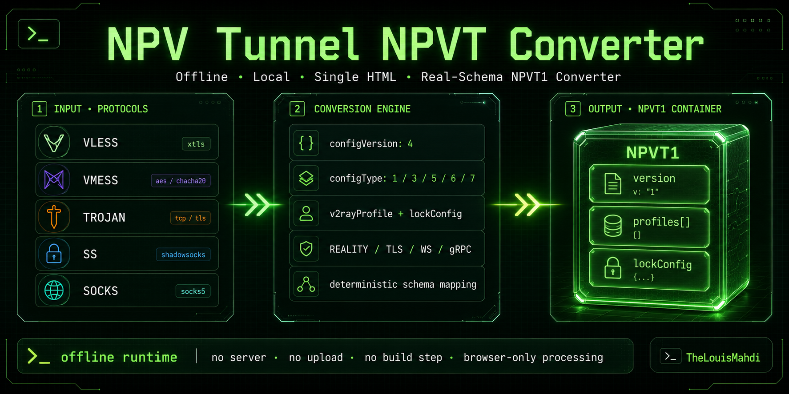
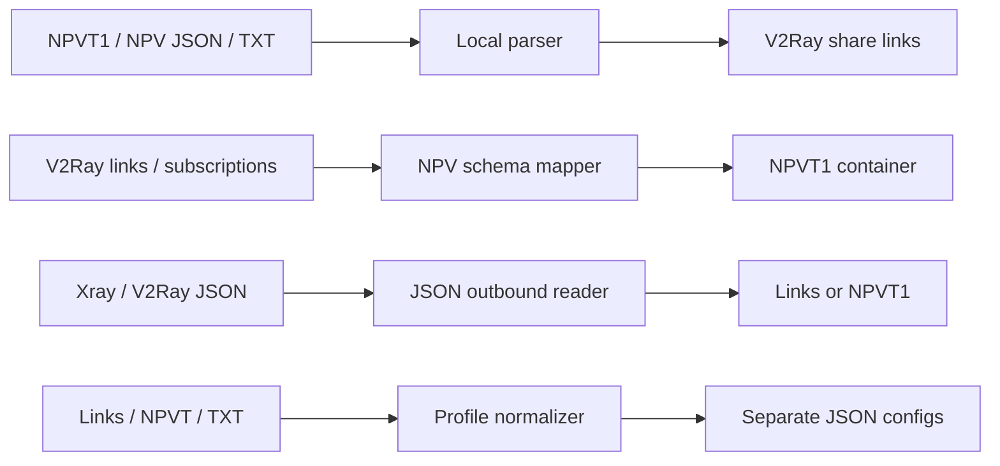
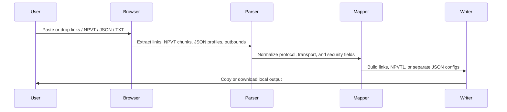

<div align="center">


<br />
<br />



# NPV Tunnel NPVT Converter

<strong>Offline · Local · Single HTML · NPVT1 · V2Ray Links · Xray JSON Toolkit</strong>

<br><br>

<a href="https://github.com/TheLouisMahdi/npvt-terminal-converter/archive/refs/heads/main.zip">
  
</a>
<a href="https://github.com/TheLouisMahdi/npvt-terminal-converter/raw/main/Index.html">
  
</a>


<h2>
  <a href="https://github.com/TheLouisMahdi/npvt-terminal-converter/archive/refs/heads/main.zip">Download for mobile</a>
</h2>

<p>
  Mobile browsers may open raw HTML as text. Use the ZIP download above, then extract and open <code>Index.html</code> locally.
</p>

</div>

---

## Overview

**NPV Tunnel NPVT Converter** is a browser-only conversion toolkit for moving configurations between NPV Tunnel `.npvt` containers, V2Ray-style share links, and Xray/V2Ray JSON profiles.

The project is designed as a single portable HTML file. It does not require installation, bundling, a backend server, external APIs, or upload endpoints. All parsing, decoding, mapping, JSON generation, NPVT1 building, and file output happen locally inside the browser runtime.

The current engine is based on real NPVT1 exports and expanded with a bidirectional JSON toolkit. It understands NPV-style profile wrappers, `v2rayProfile`, embedded `v2rayJson`, Xray/V2Ray `outbounds`, `streamSettings`, `vnext`, `servers`, WebSocket metadata, TLS/REALITY fields, and NPVT1 chunk layout.

---

## Download

### Recommended for Android / iOS

Download the repository ZIP. This forces a real file download on mobile browsers:

```text
https://github.com/TheLouisMahdi/npvt-terminal-converter/archive/refs/heads/main.zip
```

After download:

1. Extract the ZIP file.
2. Open the extracted folder.
3. Tap `Index.html`.
4. Use the converter locally in your browser.

### Direct HTML Link

Desktop browsers usually handle the direct HTML file correctly:

```text
https://github.com/TheLouisMahdi/npvt-terminal-converter/raw/main/Index.html
```

On some mobile browsers, this link may display the source code as text instead of downloading it. Use the ZIP link above if that happens.

---

## Conversion Workflows



<div align="center">


</div>

The app now includes four main panels:

| Panel | Input | Output |
|---|---|---|
| **NPVT1 / NPV JSON → V2Ray Links** | `.npvt`, `NPVT1`, NPV-style JSON, text exports, Base64 subscriptions | Clean share links |
| **V2Ray Links → NPVT1 / NPV JSON** | `vless://`, `vmess://`, `trojan://`, `ss://`, `socks://`, JSON, mixed text, subscriptions | Real-schema `.npvt` container and profile JSON |
| **Xray / V2Ray JSON → Links / NPVT** | Full Xray config, `outbounds[]`, NPV `v2rayProfile`, profile arrays, mixed JSON | Short share links or NPVT1 output |
| **Links / NPVT / TXT → Separate JSON Configs** | One link, many links, `.npvt`, `.txt`, subscription, mixed text | One standalone JSON config per profile in a TXT output |

---

## Supported Protocol Families

The converter is focused on V2Ray/Xray-compatible profile families commonly used by NPV Tunnel-style clients.

| Protocol | Link parsing | NPVT export | JSON import | JSON export | Notes |
|---|---:|---:|---:|---:|---|
| VLESS | Yes | Yes | Yes | Yes | TLS, REALITY, WS, gRPC, TCP, flow-aware |
| VMess | Yes | Yes | Yes | Yes | Standard Base64 `vmess://` payload parser |
| Trojan | Yes | Yes | Yes | Yes | Preserves password, TLS, SNI, WS/TCP fields |
| Shadowsocks | Yes | Yes | Yes | Yes | SIP002-style `ss://` parser |
| SOCKS | Yes | Yes | Partial | Yes | Basic SOCKS profile mapping |
| Base64 subscriptions | Yes | Extracts links | N/A | N/A | Decodes and scans supported links |

---

## NPVT1 Container Layout

The converter writes the observed three-part NPVT1 structure:

```text
NPVT1
<encrypted_version_chunk>,<encrypted_profile_array_chunk>,<encrypted_lock_config_chunk>
```

After local decoding, the logical structure is:

```text
chunk 1 -> "1"
chunk 2 -> JSON array of NPV-style profile wrappers
chunk 3 -> lockConfig JSON
```

A generated profile follows this structural model:

```json
{
  "name": "Profile name",
  "address": "server:port",
  "type": "V2RAY",
  "v2rayProfile": {
    "configVersion": 4,
    "configType": 5,
    "subscriptionId": "",
    "addedTime": 1780000000000,
    "remarks": "Profile name",
    "server": "example.com",
    "serverPort": "443",
    "password": "uuid-or-password",
    "network": "ws",
    "security": "tls",
    "v2rayJson": "",
    "persistJson": true
  },
  "lockConfig": {
    "version": 1,
    "isLocked": true,
    "password": "",
    "onlyMobileNetwork": false,
    "blockRootedAndJailbroken": true,
    "onlyOfficialStores": false,
    "expiryDate": "",
    "deviceIds": "",
    "message": "",
    "customServerMessage": ""
  }
}
```

---

## JSON Toolkit

The JSON toolkit is designed for real exported configs, not only ideal examples. It can read full Xray/V2Ray config files, profile arrays, NPV wrappers, and embedded NPV JSON strings.

### JSON input models

Supported JSON shapes include:

```json
{
  "outbounds": [
    {
      "tag": "proxy",
      "protocol": "vless",
      "settings": {},
      "streamSettings": {}
    }
  ]
}
```

```json
{
  "name": "Profile name",
  "type": "V2RAY",
  "v2rayProfile": {
    "remarks": "Profile name",
    "server": "example.com",
    "serverPort": "443",
    "network": "ws",
    "security": "tls",
    "v2rayJson": "{...}",
    "persistJson": false
  }
}
```

```json
[
  { "v2rayProfile": { "configType": 5 } },
  { "v2rayProfile": { "configType": 6 } }
]
```

### JSON output model

The reverse JSON exporter generates one standalone Xray/V2Ray-style JSON config per profile. The TXT output separates configs with a blank line so each profile remains easy to copy, inspect, or save individually.

Output is designed around this structure:

```json
{
  "log": {},
  "dns": {},
  "inbounds": [],
  "outbounds": [
    {
      "tag": "proxy",
      "protocol": "trojan",
      "settings": {},
      "streamSettings": {}
    }
  ],
  "routing": {}
}
```

---

## Computable Mapping Rules

The conversion engine uses deterministic mapping rules so each link, JSON outbound, or NPV profile becomes a predictable normalized profile.

### Protocol to `configType`

| Effective protocol | `configType` | Meaning |
|---|---:|---|
| VMess | `1` | VMess profile |
| Shadowsocks | `3` | Shadowsocks profile |
| VLESS | `5` | VLESS profile |
| Trojan | `6` | Trojan profile |
| SOCKS | `7` | SOCKS profile |

### VLESS Non-UUID Handling

Some public links use `vless://` syntax with a non-UUID user field, for example:

```text
vless://humanity@example.com:443?security=tls&type=ws
```

The converter handles this case as a compatibility rule:

```text
vless:// + non-UUID user id -> Trojan-style NPV profile
```

This rule improves compatibility with real NPV imports where non-UUID VLESS-style links may be represented as Trojan-like profiles internally.

---

## Transport Preservation

The converter preserves connection-critical fields instead of flattening or discarding them.

| Layer | Preserved fields |
|---|---|
| TCP / RAW | `headerType`, `security`, `sni`, `alpn`, `flow` |
| WebSocket | `path`, `host`, `headers.Host`, `security`, `sni`, `alpn`, `allowInsecure` |
| gRPC | `serviceName`, `authority`, `mode`, `xhttpMode` |
| TLS | `sni`, `serverName`, `alpn`, `fingerprint`, `allowInsecure` |
| REALITY | `pbk`, `publicKey`, `sid`, `shortId`, `spx`, `spiderX`, `fp`, `sni`, `flow`, `allowInsecure` |

The transport mapper follows the same layered idea used by Xray-style configurations: protocol identity, network transport, and transport security are treated as separate fields that must remain compatible with each other.

### WebSocket host preservation

For WebSocket-based profiles, `host` is treated as the WebSocket Host header, not only as the server address. This is important for CDN-style profiles where the connection may fail or show no ping if the WebSocket host header is dropped.

---

## REALITY and XTLS Vision Mapping

For VLESS REALITY links and JSON outbounds, URI parameters and JSON fields are mapped into Xray-style stream settings before being embedded into the NPV profile.

| Link parameter | JSON field | Internal meaning |
|---|---|---|
| `security=reality` | `streamSettings.security` | Enables REALITY transport security |
| `pbk` | `realitySettings.publicKey` | REALITY public key |
| `sid` | `realitySettings.shortId` | REALITY short ID |
| `spx` | `realitySettings.spiderX` | REALITY spiderX |
| `fp` | `realitySettings.fingerprint` | Client fingerprint |
| `sni` | `realitySettings.serverName` | Server name |
| `flow=xtls-rprx-vision` | `settings.vnext[].users[].flow` | VLESS flow control |

REALITY and flow-sensitive profiles may be stored with a full `v2rayJson` representation because these profiles are sensitive to stream structure, flow, security, and transport details.

---

## Field-Based vs JSON-Based Storage

The engine chooses between field-based and JSON-based profile storage depending on profile complexity.

| Storage mode | Used for | Reason |
|---|---|---|
| `persistJson: true` | Simple field-readable profiles such as VLESS WS/TLS, gRPC, and compatible Trojan WS/TLS exports | Keeps the NPV profile clean and close to real NPV exports |
| `persistJson: false` | REALITY, VMess, TCP-sensitive, or structure-sensitive profiles | Preserves full outbound/inbound JSON structure |

This gives simple profiles a compact NPV representation while protecting complex profiles from losing important stream settings.

---

## Local Runtime Design



The UI includes direct shortcuts for the main conversion surfaces: NPVT to links, links to NPVT, JSON tools, links to JSON, and results table.

---

## Feature Matrix

| Feature | Status |
|---|---:|
| Single HTML app | Complete |
| Offline browser runtime | Complete |
| V2Ray link extraction | Complete |
| NPVT1 three-chunk writer | Complete |
| NPVT1 profile-array reader | Complete |
| Xray/V2Ray JSON import | Complete |
| JSON to share links | Complete |
| JSON to NPVT1 | Complete |
| Links / NPVT / TXT to separated JSON configs | Complete |
| VLESS TLS / WS mapping | Complete |
| VLESS REALITY mapping | Complete |
| VMess parser | Complete |
| Trojan parser | Complete |
| Trojan WS/TLS field-based export compatibility | Complete |
| Shadowsocks SIP002 parser | Supported |
| SOCKS parser | Supported |
| WebSocket Host header preservation | Complete |
| Base64 subscription scan | Complete |
| Profile JSON export | Complete |
| Duplicate link filtering | Complete |
| Server-side sync | Not included by design |

---

## Usage

### Convert NPVT / NPV JSON / TXT to V2Ray links

1. Open `Index.html` in a browser.
2. Drop or choose `.npvt`, `.json`, `.txt`, or subscription files.
3. Extract profile data locally.
4. Copy or download the generated share links.

### Convert V2Ray links to NPVT

1. Open `Index.html` in a browser.
2. Paste supported V2Ray links into the V2Ray-to-NPVT panel.
3. Click **Build NPVT**.
4. Download the generated `.npvt` file.
5. Import it into NPV Tunnel.

Example input:

```text
vless://uuid@example.com:443?security=tls&type=ws&host=example.com&path=%2Fws&sni=example.com#Example
```

### Convert JSON to links or NPVT

1. Paste a full Xray/V2Ray JSON config, an NPV `v2rayProfile`, or a profile array into the JSON panel.
2. Click **JSON → Links** for shorter share links.
3. Click **JSON → NPVT** for a direct NPVT1 output.
4. Copy or download the local output.

### Convert links / NPVT / TXT to separated JSON configs

1. Paste one link, multiple links, a subscription, or mixed text into the links-to-JSON panel.
2. Or drop `.npvt`, `.txt`, `.json`, `.conf`, `.yaml`, or `.yml` files.
3. Click **Links → JSON**.
4. Download the generated TXT file.

The JSON TXT output stores one pretty JSON config per profile and keeps an empty line between each JSON block.

---

## NPV Tunnel Ping Note

NPV Tunnel may sometimes show no ping or report ping as unavailable even when an imported profile is structurally valid. The app's ping/check routine is not always equivalent to a real tunnel connection attempt.

If the server itself is alive and the protocol, transport, SNI, security settings, routing path, and network access are healthy, the profile can still connect normally even when ping is not displayed. Do not treat a missing ping result alone as proof that the generated `.npvt` file is broken.

This converter only maps and exports profile data. It cannot guarantee upstream server availability, ISP routing, DNS behavior, firewall state, or server-side configuration health.

---

## Privacy Model

This project is local-first by design.

| Area | Behavior |
|---|---|
| File processing | Browser memory only |
| Network requests | None required for conversion |
| Backend server | None |
| Telemetry | None |
| Upload endpoint | None |
| Output generation | Local Blob download |

Sensitive fields such as UUIDs, passwords, SNI values, REALITY public keys, server addresses, WebSocket hosts, and paths are processed locally inside the browser runtime.

---

## Repository Layout

```text
.
├── Index.html                 # Main single-file converter
├── README.md                  # Project documentation
├── LICENSE                    # License
└── assets/
    └── Prev.png               # GitHub README preview image
```

---

## Technical References

- [NPV Tunnel on Google Play](https://play.google.com/store/apps/details?id=com.napsternetlabs.napsternetv)
- [Xray VLESS documentation](https://xtls.github.io/en/config/inbounds/vless.html)
- [Xray transport configuration](https://xtls.github.io/en/config/transport.html)
- [V2Fly VMess documentation](https://www.v2fly.org/en_US/config/protocols/vmess.html)
- [Shadowsocks SIP002 URI Scheme](https://github.com/shadowsocks/shadowsocks-org/wiki/SIP002-URI-Scheme)

---

## Author

Made by **THELOUISMAHDI**  
GitHub: [TheLouisMahdi](https://github.com/TheLouisMahdi)

<div align="center">

<br />

<a href="https://github.com/TheLouisMahdi">
  
</a>

<br />
<br />


<br />
<br />


</div>

---

## Disclaimer

This project is an independent local converter and is not affiliated with NPV Tunnel, NapsternetV, V2Ray, Xray, Vonmatrix, or Shadowsocks.

Use it only with configuration files and links that you own or are authorized to manage.

---

## License

MIT License
